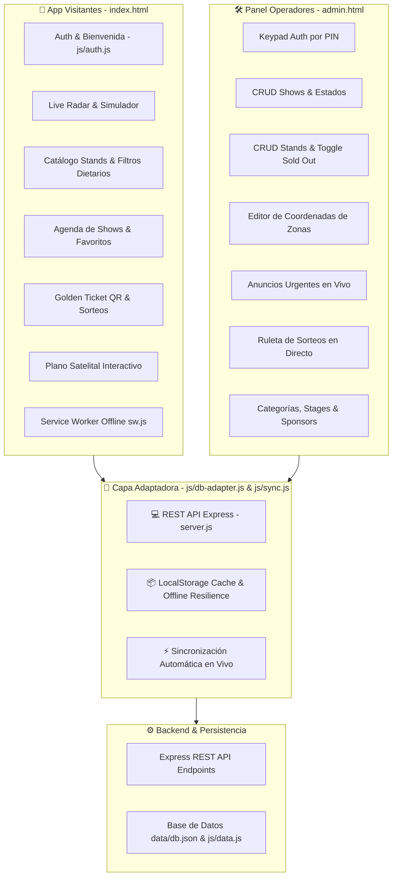

# 🌿 EcoGastroFest 2026 - Documento Maestro de Contexto y Arquitectura

> **Fuente Única de Verdad (Single Source of Truth - SSOT)**  
> **Versión del Proyecto:** 1.6.0  
> **Ubicación:** `c:\Users\Martin\.gemini\antigravity-ide\scratch\gastrofest-app`  
> **Última Actualización:** 18 de Agosto de 2026

---

## 📌 1. Visión General y Propósito

**EcoGastroFest 2026** es una plataforma digital Progressive Web App (PWA) de alto rendimiento desarrollada para la *Feria Gastronómica Sustentable de San José de Mayo, Uruguay* (Plaza Independencia). 

La plataforma cubre dos frentes de manera coordinada y en tiempo real:
1. **📱 App Visitantes (PWA Mobile-First / Desktop)**: Experiencia para los asistentes con bienvenida y autenticación (Google / Invitado), catálogo de puestos, filtros dietarios (Vegano, Celíaco), agenda con favoritos, radar de espectáculos en vivo, simulador de horarios, plano satelital interactivo, trivias sustentables y tickets dorados para sorteos con código QR interactivo.
2. **🛠️ Panel de Operadores (Admin Dashboard)**: Interfaz de gestión rápida con acceso por PIN para organizadores, que permite CRUD de stands, control de stock y plato agotado (`Sold Out`) en caliente, programación de shows, emisión de anuncios urgentes, ruleta en vivo de sorteos, edición de coordenadas del mapa y gestión dinámica de categorías/sponsors.

---

## 🏗️ 2. Arquitectura del Sistema

---

## 📂 3. Inventario Completo de Archivos y Módulos

| Archivo / Carpeta | Tipo | Responsabilidad / Descripción |
| :--- | :--- | :--- |
| `index.html` | Frontend | PWA principal de visitantes con tabs (Live, Agenda, Stands, Sorteo, Info/Mapa) y modales de Auth. |
| `admin.html` | Frontend | Panel de control de operadores con autenticación por PIN y pestañas CRUD. |
| `manifest.json` | PWA | Metadatos de la aplicación para instalación nativa (Android, iOS, Windows). |
| `sw.js` | Service Worker | Estrategia de caché *Stale-While-Revalidate* para uso 100% offline. |
| `package.json` | Config | Dependencias: `express`, `sharp`, `jsdom`, `cors`. |
| `server.js` | Backend | Servidor Express con endpoints REST completos y persistencia JSON. |
| `server.ps1` | Backend | Servidor HTTP nativo en PowerShell como respaldo sin Node.js. |
| `css/styles.css` | Estilos | Sistema de diseño de la PWA (Dark Eco Theme, CSS Variables, Responsive). |
| `css/admin.css` | Estilos | Estilos del panel de control, teclado numérico PIN, modales y tablas. |
| `data/db.json` | Base de Datos | Estructura de datos completa (Event, Stands, Shows, Stages, Zones, Sponsors, etc.). |
| `js/app.js` | Lógica App | Coordinador general, enrutador de pestañas, mapa satelital y audios. |
| `js/admin.js` | Lógica Admin | Lógica del panel de control, CRUDs, sincronización y ruleta de sorteos. |
| `js/auth.js` | Autenticación | Inicio de sesión con Google, modo Invitado, gestión de sesión y chip de perfil. |
| `js/db-adapter.js` | Adaptador DB | Adaptador para comunicación REST API con Express y fallback offline en LocalStorage. |
| `js/sync.js` | Sincronización | Monitor de estado de conexión (`online`/`offline`) y sincronización reactiva. |
| `js/live-radar.js` | Módulo | Motor de cálculo de show en vivo, barras de progreso y simulador de horas. |
| `js/agenda.js` | Módulo | Renderizado de shows, fotos WebP de artistas, filtro por días y favoritos. |
| `js/stands.js` | Módulo | Renderizado de puestos, menú con precios, etiquetas Sin TACC/Vegano y modal. |
| `js/raffle.js` | Módulo | Registro a sorteos, generador de Golden Ticket y renderizado QR en Canvas. |
| `js/pwa.js` | Módulo | Manejo de evento `beforeinstallprompt` y registro de Service Worker. |
| `js/data.js` | Datos | Inicialización del objeto global `GASTRO_DATA` en memoria (`window.GASTRO_DATA`). |
| `scripts/fetch_and_convert_artists.js` | Script | Pipeline automatizado con `sharp` para procesar fotos de artistas uruguayos a WebP (<100KB). |
| `images/artists/*.webp` | Medios | 10 fotografías optimizadas en WebP de los artistas del festival. |
| `test_multiagent_simulation.js` | Pruebas | Framework multi-agente con 5 perfiles concurrentes (**45 aserciones**). |
| `test_all_app_buttons.js` | Pruebas | Suite automatizada de **82 pruebas** JSDOM que valida 100% de la UI, Leads, Auth y botones. |
| `test_dynamic_system.ps1` | Pruebas | Suite automatizada de 9 pruebas de integración backend y sincronización. |
| `test_crud.ps1` / `test_eco_sponsors.ps1` | Pruebas | Pruebas unitarias de endpoints REST en PowerShell. |
| `github_deploy.js` | Despliegue | Script de despliegue directo a GitHub y sincronización con GitHub Pages. |
| `CHANGELOG.md` | Documentación | Historial cronológico estandarizado de versiones (*Keep a Changelog*). |
| `AGENTS.md` | Contexto Multi-Máquina | Protocolo de arranque universal para instancias de Antigravity. |
| `README.md` | Documentación | Guía de instalación, inicio rápido y arquitectura general. |

---

## 🔌 4. Especificación de Endpoints REST (Servidor Local)

| Método | Ruta | Parámetros / Body | Descripción |
| :--- | :--- | :--- | :--- |
| `GET` | `/api/sync` | Ninguno | Retorna el árbol completo de datos del festival (incluyendo usuarios). |
| `PUT` | `/api/event` | Objeto `event` | Actualiza título, horarios, dirección y enlaces a mapas. |
| `POST`| `/api/stands` | Objeto `stand` | Da de alta un nuevo puesto gastronómico. |
| `PUT` | `/api/stands/:id` | Objeto modificado | Actualiza campos de un stand gastronómico. |
| `DELETE`| `/api/stands/:id` | URL param `id` | Elimina un stand gastronómico. |
| `POST`| `/api/stands/:id/menu` | `{ item, desc, price, isSoldOut }` | Agrega un plato al menú de un stand. |
| `PUT` | `/api/stands/:id/menu` | `{ item, isSoldOut }` | Conmuta el estado de stock (agotado/disponible) de un plato. |
| `POST`| `/api/schedule` | Objeto `show` | Programa un nuevo show en la agenda. |
| `PUT` | `/api/schedule/:id` | Objeto modificado | Edita horario, orador, escenario o descripción de un show. |
| `DELETE`| `/api/schedule/:id` | URL param `id` | Da de baja un show de la agenda. |
| `POST`| `/api/zones` | Objeto `zone` | Agrega una nueva zona al mapa satelital. |
| `PUT` | `/api/zones/:id` | Objeto `zone` | Actualiza coordenadas y metadatos de una zona. |
| `DELETE`| `/api/zones/:id` | URL param `id` | Elimina una zona del mapa satelital. |
| `POST`| `/api/categories` | `{ type: "stand"\|"show", id, name, icon }` | Crea una categoría dinámica. |
| `DELETE`| `/api/categories/:type/:id` | URL params | Elimina una categoría dinámica. |
| `POST`| `/api/stages` | `{ id, name, icon }` | Agrega un nuevo escenario. |
| `DELETE`| `/api/stages/:id` | URL param `id` | Elimina un escenario. |
| `POST`| `/api/sponsors` | `{ tier: "gold"\|"silver", name, tierName, icon }` | Da de alta un patrocinador sustentable. |
| `DELETE`| `/api/sponsors/:tier/:name` | URL params | Elimina un patrocinador. |
| `POST`| `/api/announcements` | `{ type, icon, title, message, active }` | Publica un aviso en vivo para los visitantes. |
| `DELETE`| `/api/announcements/:id` | URL param `id` | Elimina un aviso en vivo. |
| `POST`| `/api/raffle/register`| `{ name, phone, stand }` | Registra a un visitante y genera un ticket serial. |
| `GET` | `/api/users` | Ninguno | Retorna la lista completa de usuarios y leads registrados. |
| `POST`| `/api/users` | `{ id, name, email, avatar, provider }` | Registra o actualiza un lead de visitante para marketing. |
| `DELETE`| `/api/users/:id` | URL param `id` | Elimina un lead de la base de datos. |
| `GET` | `/api/users/export/csv` | Ninguno | Descarga directa de archivo CSV para Mailchimp / Email Marketing. |
| `DELETE`| `/api/raffle/participants/:code`| URL param `code` | Elimina un ticket del sorteo. |
| `POST`| `/api/auth/login` | `{ pin: "1234" }` | Autentica a un operador en el panel de control. |

---

## ⚡ 5. Resiliencia y Estrategia de Datos (Offline-First)

1. **Sincronización Transparente Express REST + LocalStorage**:
   - La arquitectura opera de forma autónoma y veloz con el backend Express y `data/db.json`.
   - El cliente PWA y el panel de administración sincronizan de forma optimista con `localStorage.getItem('gastrofest_db')` para garantizar funcionamiento continuo ante cortes de red en el festival.
2. **Caché Estático Service Worker (`sw.js`)**:
   - Almacena en caché todos los activos esenciales (HTML, CSS, JS, imágenes WebP de artistas y fuentes de Google).

---

## 🧪 6. Suites de Pruebas y Validación de Calidad

| Suite | Comando | Cantidad de Pruebas | Estado |
| :--- | :--- | :--- | :--- |
| **Simulación Multi-Agente (5 Perfiles)** | `node test_multiagent_simulation.js` | **41 / 41** | ✅ 100% Pasadas |
| **Pruebas de Botones & UI (JSDOM)** | `node test_all_app_buttons.js` | **66 / 66** | ✅ 100% Pasadas |
| **Pruebas Dinámicas Backend** | `powershell -ExecutionPolicy Bypass -File test_dynamic_system.ps1` | **9 / 9** | ✅ 100% Pasadas |
| **Optimización de Artistas WebP** | `node scripts/fetch_and_convert_artists.js` | 10 Artistas | ✅ Todos < 100 KB |
| **Verificación de Servidores** | `powershell -ExecutionPolicy Bypass -File check_status.ps1` | 2 Servidores | ✅ Activos |
